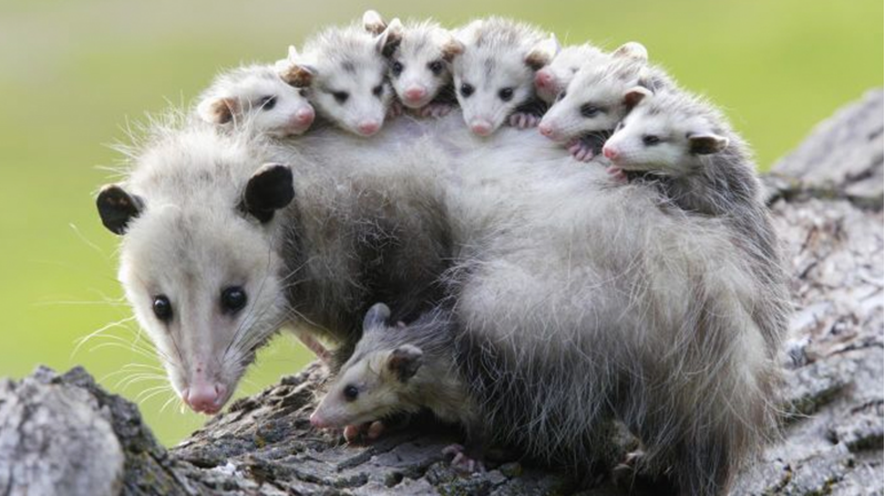

```{r, echo=FALSE}
# The UW logo located on the top-right corner of the report
htmltools::img(src = knitr::image_uri(file.path(R.home("doc"), "html", "uw_logo_1_150x150.jpg")), 
               alt = 'logo', 
               style = 'position:absolute; top:0; right:0; padding:0px;')
```

# Description

This is a report for the analysis of the different measures between tow major types of possums which are one of the species of [Phalangeriformes](https://en.wikipedia.org/wiki/Phalangeriformes) and are mostly originated from Australia, New Guinea, and Sulawesi. 
The data for this report has been gathered from [OpenIntro](https://www.openintro.org/data/index.php?data=possum) and the purpose of the analysis is to find out interesting relations between 8 features as follow:

* site: The site number where the possum was trapped.
* pop: Population, either Vic (Victoria) or other (New South Wales or Queensland).
* sex: Gender, either m (male) or f (female).
* age: Age.
* head_l: Head length, in mm.
* skull_w: Skull width, in mm.
* total_l: Total length, in cm.
* tail_l: Tail length, in cm.


{width=70%}

# Scatter Plots
Let's start the analysis by importing the ggplot2 library, then reading the dataset from a csv file and save it to a df variable.
```{r message=FALSE, warning=FALSE}
library(ggplot2)
library(ggthemes) # For the economist theme
library(dplyr) # For pipe operator which I used as an alternative way to produce a plot variable
```

Let's take a quick look at the data first
```{r}
df <- read.csv('possum.csv')
knitr::kable(sample_n(df, size = 5)) # Random sample of 5 observations
```

Now let's begin to explore the relation between variables. Starting off by a simple scatter plot and tweak it as we go further. 


```{r}
p <- ggplot(data = df, aes(x = head_l, y = skull_w))
p1 <- p + labs(x = "Head length",
               y = "Skull width",
               title = "Head length vs Skull width") + geom_point()
p1
```

How about some informative caption and subtitle? We can also distinguish between the female and male possums by adding a color (so called ***hue*** in Matplotlib environment). In addition we can clearly see the positive linear relationship between the two variable which makes sense specially for male possums which are bigger in size and in order to make it visible on plot, we can use a **geom_smooth()** function with **lm** as a method. The formula by default is **formula = y ~ x **. Let's not forget to alter the name of the legend so it won't use the column name instead. In addition I'm going to change the style for subtitle so it stands out from the main title.

```{r message=FALSE}
p <- ggplot(data = df, aes(x = head_l, y = skull_w, color = sex))
p1 <- p + labs(x = "Head length",
               y = "Skull width",
               subtitle = 'Realtion between the length of the head and width of the skull',
               caption = 'Data gathered from OpenIntro',
               title = "Head length vs Skull width") + geom_point() +
  geom_smooth(method="lm", color="#FDDB27FF", linetype=2) +
  guides(color = guide_legend(title = "Sex",
                              title.position = "left",
                                  title.hjust = 0.5)) +
  theme(plot.title = element_text(color = '#0088DC', 
                                    size = 17,
                                    face = 'bold.italic'))
p1
```

Noticed that wide-skull female possum? We can annotate it to show that outlier in a clear way. Also we can alter the legend and the way it looks by passing **override.aes**. Plus we can use different predefined theme from **ggthemes** package and it's gonna the economist theme which I personally enjoy it! 


```{r message=FALSE}
p <- ggplot(data = df, aes(x = head_l, y = skull_w, color = sex))
p1 <- p + labs(x = "Head length",
               y = "Skull width",
               subtitle = 'Realtion between the length of the head and width of the skull',
               caption = 'Data gathered from OpenIntro',
               title = "Head length vs Skull width") + geom_point(shape=15,  size = 3) +
  geom_smooth(method="lm", color="#FDDB27FF", linetype=2) +
  guides(color = guide_legend(title = "Sex",
            override.aes = list(shape = 15, alpha = 1, size = 8))) +
  annotate("text", x = 96.6, y = 67.8, label = "A wide-skull female", size=2.5) 

p1 + theme_economist()  # We can also use another theme for the plot from the package ggthemes
```

But we can also plot more information based on our data. For example in the plot below I decided to include **pop** variable which shows whether the possum is came from Victoria population or other population such as New South Wales and Queensland. We can also include **geom_rug()** to display individual since our dataset is not that large. In the plot below we can find out that in overall the variance of head length for Victoria population is smaller than other population as the most triangle shapes (Victoria) are bundled together and are closer to each other. 

```{r message=FALSE}
p <- ggplot(data = df, aes(x = head_l, y = skull_w,color = sex, shape=pop ))
p1 <- p + labs(x = "Head length",
               y = "Skull width",
               subtitle = 'Realtion between the length of the head and width of the skull',
               caption = 'Data gathered from OpenIntro',
               title = "Head length vs Skull width") + geom_point(size=3) +
  geom_smooth(method = "lm", color="#FDDB27FF", linetype=2, size = 0.1) +
    guides(color = guide_legend(title = ("Sex"))) +
  geom_rug(length = unit(0.03, "npc"))  + # For x and y observations on the axes
  theme(plot.title = element_text(color = '#0088DC', 
                                    size = 17,
                                    face = 'bold.italic')) + 
annotate("text", x = 97.6, y = 67.9, label = "A wide-skull female from Victoria", size=2.5) 

p1 + theme_economist(dkpanel = TRUE) # Darker background for panel region to
```

We can also gain more insights from the data by adding yet another variable to the plot. In the plot below I added age groups to track the relation between head length and skull width across different ages. Clearly (specially in Victoria population) the more the possum aged, the more the length of the head and the width of skulls will be. Also I used a pipe operator this time to feed the ggplot with the df. 

```{r message=FALSE, warning=FALSE}
df %>% ggplot(aes(x=total_l,y=tail_l,col=sex,size=age))+ 
  labs(x = "Head length",
               y = "Skull width",
               subtitle = 'Realtion across male and female for different age bin and different poplation',
               caption = 'Data gathered from OpenIntro',
               title = "Head length vs Skull width") + 
geom_point(shape=16, alpha=0.6)+
geom_smooth(se=0,method='lm', color="#1B1E23", linetype=2, size = 0.75)+
facet_wrap(~pop, scales = 'free') + guides(color = guide_legend(keyheight = 1, # the height of a rectangle
                                 keywidth = 1, override.aes = list(shape = 16, size = 3))  # the width of a rectangle
)  +
  theme(legend.key = element_rect(fill = '#D3D3D3'))
```

Similarly we can create other scatter plots that shows relation between other variables. For example in the plot below we can see that even though the species in the Victoria population tends to have a smaller tails but their overall length doesn't differ that much from other population group. The linear trend is also prevalent. 

```{r message=FALSE}
p <- ggplot(data = df, aes(x = tail_l, y = total_l, color = pop))
p1 <- p + labs(x = "Tail length",
               y = "Total length",
               subtitle = 'Realtion between the length of the tail and the total length',
               caption = 'Data gathered from OpenIntro',
               title = "Tail length vs Total length") + geom_point(shape=18,  size = 2.5) +
  geom_smooth(method="lm", color="#FDDB27FF", linetype=2) +
  guides(color = guide_legend(title = "Pop",
            override.aes = list(shape = 19, alpha = 1, size = 3)))

p1 + theme_economist(dkpanel = TRUE)  +
  theme(plot.background=element_rect(fill = "#E9967A"),legend.position="bottom",
              legend.text = element_text(colour="black", size=9, face="bold"))
```

Last but not the least we can explore the relation between total length and head length across the sites where possums trapped (7 sites). Although weak but we can see a positive relation between these two variables. 

```{r,message=FALSE, warning=FALSE}
df$total_l <- df$total_l*10 # Changing total length to mm
df%>%ggplot(aes(x=total_l,y=head_l,col=sex,size=age))+ 
  labs(x = "Total length",
               y = "Head length",
               subtitle = 'Realtion across male and female for different age bin and different sites',
               caption = 'Data gathered from OpenIntro',
               title = "Head length vs Total length") + 
geom_point(shape=16, alpha=0.6, show.legend = T) +
geom_smooth(se=0,method='lm', color="#1B1E23", linetype=2, size = 0.5)+
facet_wrap(~site, scales = 'free')
```

<style>
body {
text-align: justify}
</style>

<div class="tocify-extend-page" data-unique="tocify-extend-page" style="height: 0;"></div>
